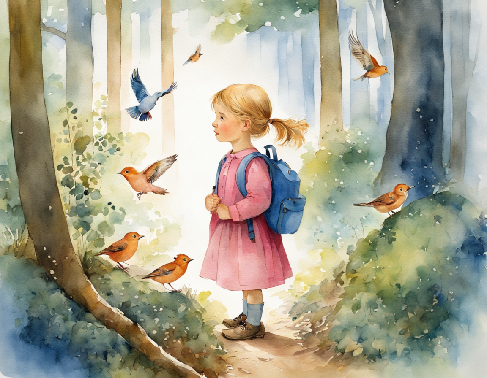
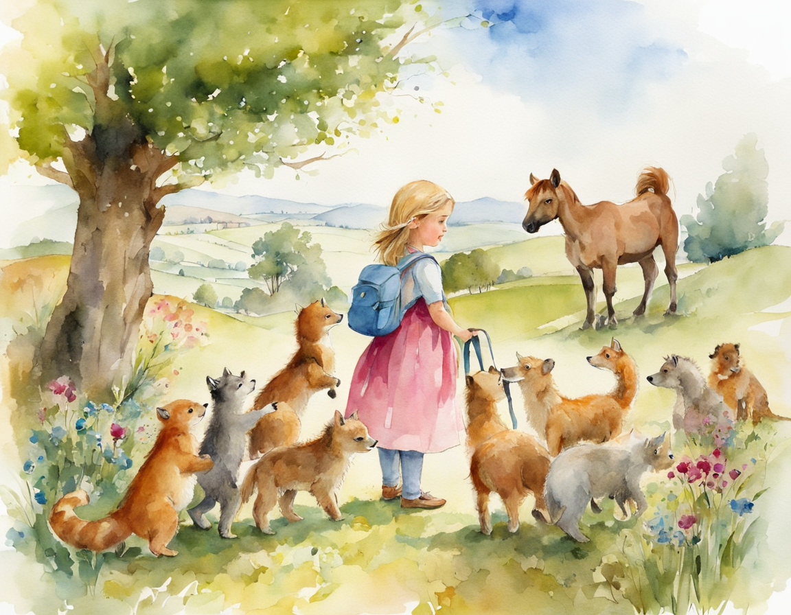

# 【儿童绘本文案】Prompts Generator for Stable Diffusion

- 🌈这个Prompt，可以按你的要求输出【儿童绘本文案】的文案，及对应的Stable Diffusion的提示词。 
- 建议使用GPT-4，输入Prompt，即可开始体验。
_________________

## 效果概览：

_________________

- 🙏欢迎订阅我的YouTube频道👏：https://www.youtube.com/@AIGeniusMinds
- 🙏欢迎关注我的FlowGPT主页👏：https://flowgpt.com/@tyler-coman

## 致谢
- 感谢[LangGPT](https://github.com/yzfly/LangGPT)结构化提示词项目对我创作的启发！
- 感谢[FlowGPT](https://flowgpt.com/)站点，上面有很多优秀的Prompt！
